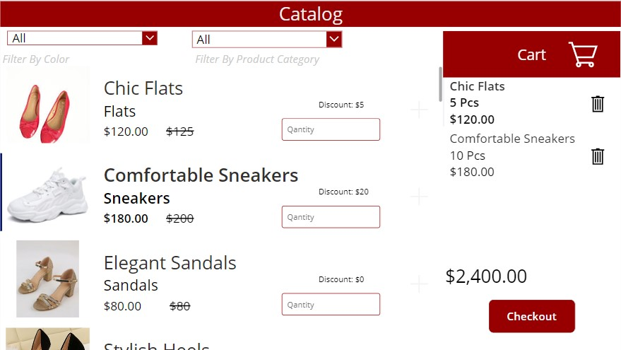

# Shoe-Styles-app
A Microsoft Power Platform Project

## Introduction

The Microsoft Power Up Program is a three month program created by Microsoft which is focused on training individuals without a coding experience on the use of Microsoft Power Platform: a low code solution that enables users to build applications, automations, chatbots and model driven apps that can be shared with members of of an organization in order to save time, minimize costs and improve operational efficiency.

## Business Scenario

**SoleStyle** is a boutique shoe company specializing in high-end footwear. The company aims to have an efficient way of tracking their shoe products, managing stock levels, and providing seamless shopping experience for customers. They want to streamline their inventory management process, so you will build an app using Power Platform

## User Requirements

**Store Staff**

The store staff must be able to:
- View a list of available shoe products by category and price.
- Show and edit product details including name, price, discount, quantity.
- Configure Dataverse for storing and managing inventory data.
- Using Model driven apps, implement inventory management features, i.e., product sorting, filtering, and removal.

### Customer

The customer must be able to: 
- Browse, search and filter for products available in the boutique.
- Add items to a shopping cart.
- Build the checkout process, include product details, quantities, prices, and total cost, is clearly presented to the customer before checkout
- Develop a Power Virtual Agent for customer inquiries. Must have at least 5 built-in questions and answers

### Manager

 The manager must be able to:
- Receive a notification when new stock is added
- Create a Power BI dashboard for data visualization and analysis, including generating regular reports and analytics related to inventory levels, turnover rates, popular products, and slow-moving items.

## Solution

### Store staff

On clicking in the “Storekeeper” Button, the store staff is taken to a screen where they can view and edit properties of each product namely Price, Quantity in Stock and Discount.

To be able to view a tabular list of all the details of the current inventory in stock, I created a model driven app to solve this problem. 

When the store staff clicks on the Add new or + sign, this form pops up and the store staff fills in the details of the new product and saves it.

when this happens the manager gets an email notifying him of the addition of a new product and the  product is available in the app the next time it is opened

### Customer

on the welcome screen, I added an Ai virtual agent using Power Virtual Agent which answers basic frequently asked questions like the opening and closing times, what items are In stock, etc.
on selecting the “Go shopping” Button, the customer is taken to the Catalog page. 

This is the main screen of the app. This is where the customer does the shopping. Here, the customer can view basic information about products like price and discount and can enter the quantity of products he would like to purchase.

when the customer adds a product to the cart, a popup appears that confirms that the items have been added to cart and hen the customer chooses whether to keep shopping or checkout.

when the customer is done shopping, he then goes to the checkout screen. 
in this screen, the customer views all items selected with their respective quantities, subtotal, and the total cost of the orders. 
The customer then enters his personal information and clicks on the “place order” button. 

If the order is successfully placed, the customer gets a screen notifying him of the successfully placed order. 

3 dataverse tables manage the entire transaction. 

- The Shoes table records the inventory.
- The sales order table records the Order ID, personal information and Total sales. 
- The sales order details record the individual items, their quantities, their subtotal and other information pertinent to the product.
  
when the “place order” button is selected, a couple of things happen. 
1.	An ID is created for that order.
2.	The personal information, Order ID, and Total cost of that particular order is saved to the sales orders table.
3.	The individual items and their quantities, subtotals and other information critical to that product is stored in the Sales Order Details table
4.	The quantities in the shopping cart get subtracted from the quantity in stock in the shoes table
5.	Two automations get triggered
   

The manager gets an automated email notifying him that items have been removed from the quantity in stock

The store staff gets notified of the new order 

### Manager

The manager monitors inventory levels from a dashboard. The dashboard is connected to the dataverse tables using Direct Query so the manager always has the most up to date data available at all times

## Conclusion

This project took me round all the products in the Power Platform. Although I was already conversant with power apps and power automate and have already created a couple of solutions using these products, up until I created the app, I have not created an end to end solution in that scale with that many products all working together. I’m glad the final product fulfilled all business requirements. You can view a short video demonstration of the app [here](https://www.linkedin.com/posts/asoh-eloka-603700221_powerplatform-powerapps-powerautomate-activity-7155988488780197889-_KdQ?utm_source=share&utm_medium=member_desktop). Please forgive my stuttering, I am not too conversant with making demo videos narrating all features in the app.

Thank You!!

